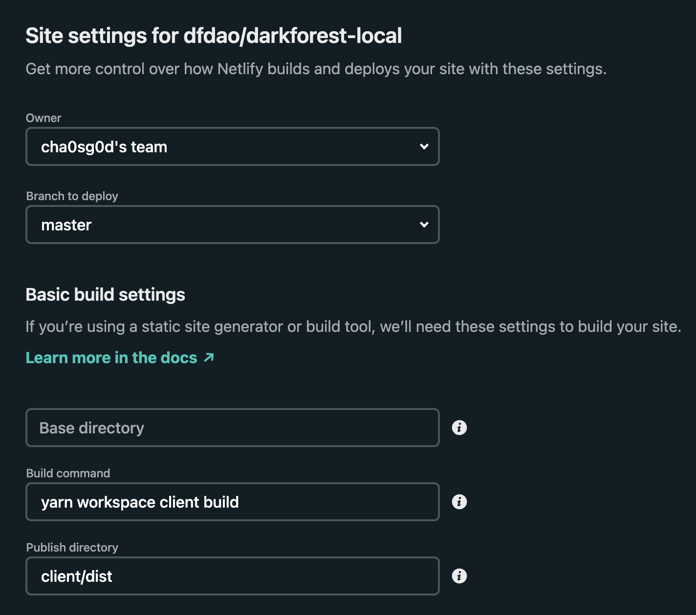
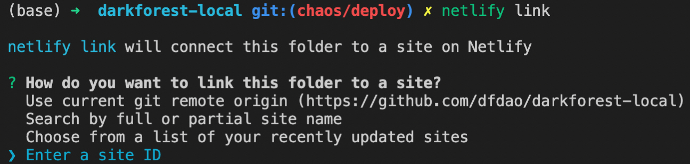
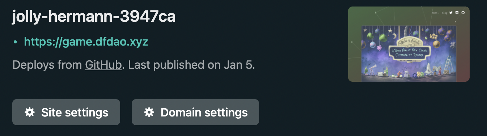
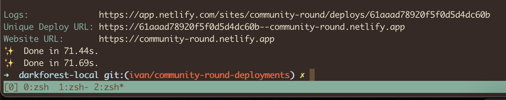
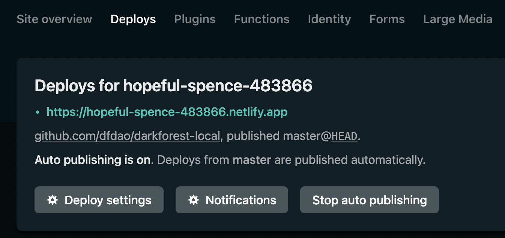

# Light Forest - Custom Dark Forest Arena Rounds

Setting up a Dark Forest Arena round requires forking dfdao's darkforest-local arena branch, updating submodules, and modifying the sprawling client codebase. Light Forest simplifies this process to forking a single repository, modifying `lightforest.toml`and deploying to your favorite web host.

## Builder's Guide

For a comprehensive tutorial on using the [Dark Forest](https://github.com/dfdao/darkforest-local) repository to make custom Dark Forest games and deploy them, check out the Dark Forest [Builder's Guide](builders_guide.md).

## How `lightforest` works

This repo connects to dfdao's [npm package registry](https://www.npmjs.com/org/dfdao) and hooks into dfdao's smart contracts on [Gnosis Optimism](https://developers.gnosischain.com/for-developers/optimism-optimistic-rollups-on-gc) so you can launch a canonical Arena round with a custom client.

## Requirements

- Install `node >= 14` (You can consider using [nvm](https://github.com/nvm-sh/nvm))
- Install [Yarn](https://classic.yarnpkg.com/en/docs/install)

### Quickstart for running a local round of Dark Forest Arena

1. go to [arena.dfdao.xyz/arena](https://arena.dfdao.xyz/arena) and create a map. Once the map is created, it will display a unique hash of the map's configuration. Copy this value and save it for later.
2. Fork [lightforest](https://github.com/dfdao/lightforest) to your GitHub account.
3. run `git clone https://github.com/<your_name>/lightforest.git`
4. run `yarn` to install dependencies
5. Customize the `lightforest.toml` file on the top level of the directory with statistics about your round.
6. `yarn start`
7. Go to `localhost:8081` and you should see your live round running locally.
8. Once you are satisfied with the round's rules, deploy your Arena round online (see Static Deployment of Dark Forest)

## Customizing your Round

##### Light Forest's toml provides a fair amount of customizability out of the box.

- Title
- Description
- Start time
- End time
- Move weight
- Time weight
- Ranks

---

To change the client or game rules, such as color scheme or score calculation, you can edit React components in this repository.
To perform deeper modifications, like changing smart contracts or packages, use [darkforest-local](https://github.com/dfdao/darkforest_local).

## Static deployment of Dark Forest (no webserver)

If you want to deploy the client code (with whatever modifications you want), you can follow these instructions.

Deploy client website

To deploy the website interface, you may either self-host, or use the same infra that we use - [Netlify](https://www.netlify.com/). This is a simple option, and free for up to some amount of gigabytes of bandwidth per month, which has often been enough for us.

To use Netlify:

- Make a new [Netlify account](https://app.netlify.com/signup) using your Github profile.
- [Import](https://app.netlify.com/start) your forked **lightforest** repo as a new Netlify site.

  - During Step 3 of the import (Site settings, and deploy!):
    - Build command: `yarn build`
    - Publish directory: `client/dist`

  Your initial settings should look like this:

  

  _Importing from Github will automatically trigger an initial build by Netlify, which will take ~5 min._

- Install the Netlify CLI
  - `npm install netlify-cli -g`
- Login to your account
  - `netlify login`
- Connect to your app
  - `netlify link`
    
- Choose _Enter a site ID_
  
- Input the id that you find by clicking on your new site on Netlify. In this example, the id is `jolly-hermann-3947ca`
- Now that your site is linked, you can deploy to Netlify from the CLI.

  - `yarn deploy:client:prod`
  - If successful, you will see something like this.
    
  - By default, all future changes to the branch you specified in the settings will result in an automatic deploy (in this case `master`).
  - You can still choose to deploy manually (via `yarn deploy:client:prod`).
  - Additionally, if you want to stop auto-publishing via git updates, see this image:
    

- Now go the URL given by Netlify → something like [https://jolly-hermann-3947ca.netlify.app/](https://jolly-hermann-3947ca.netlify.app/) and test out your game! Make some moves and test that everything works as expected. Make sure your round appears in the game leaderboard and then share the link with your friends.
